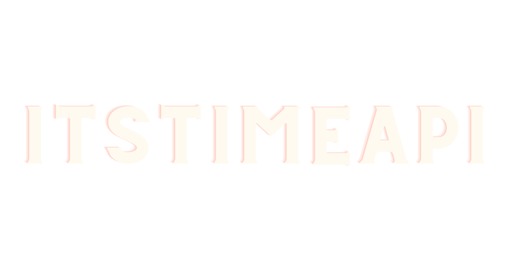

<a name="readme-top"></a>

<!-- PROJECT LOGO -->
<br />
<div align="center">
 <a href="https://github.com/ginorey/itstimeapi">
    
  </a>
  <h3 align="center">itsTimeAPI</h3>

  <p align="center">
    Free Open Source UFC API
    <br />
    <a href="https://github.com/ginorey/itstimeAPI"><strong>Explore the docs »</strong></a>
    <br />
    <br />
    <a href="https://itstimeapi.com/#introduction">View Documentation</a>
    ·
    <a href="https://github.com/ginorey/itstimeAPI/issues">Report Bug</a>
    ·
    <a href="https://github.com/ginorey/itstimeAPI/issues">Request Feature</a>
  </p>
</div>


<!-- TABLE OF CONTENTS -->
<details>
  <summary>Table of Contents</summary>
  <ol>
    <li>
      <a href="#about-the-project">About The Project</a>
      <ul>
        <li><a href="#built-with">Built With</a></li>
      </ul>
    </li>
    <li>
      <a href="#getting-started">Getting Started</a>
      <ul>
        <li><a href="#prerequisites">Prerequisites</a></li>
        <li><a href="#installation">Installation</a></li>
      </ul>
    </li>
    <li><a href="#roadmap">Roadmap</a></li>
    <li><a href="#contributing">Contributing</a></li>
    <li><a href="#license">License</a></li>
    <li><a href="#contact">Contact</a></li>
    <li><a href="#acknowledgments">Acknowledgments</a></li>
  </ol>
</details>


<!-- ABOUT THE PROJECT -->
## About The Project

Free Open Source UFC API. 

This is an ongoing project, therefore everything is subject to change. Currently you will be able to interface with the API and retrieve fighter data. Check the roadmap below for further features.

This repository holds the code that runs the itsTimeAPI. You can use this API for free, no email or API key required.

<p align="right">(<a href="#readme-top">back to top</a>)</p>


### Built With

*  
*  
*  
*  
* 

<p align="right">(<a href="#readme-top">back to top</a>)</p>


<!-- GETTING STARTED -->
## Getting Started

To get a local copy up and running follow these simple example steps.

### Prerequisites

The only prerequisite is to install Python. 
Once you have Python installed we will install all of the requirements below. 

* [Mac Installation ](https://docs.python-guide.org/starting/install3/osx/)

* [Windows Installation](https://docs.python.org/3/using/windows.html)

### Installation
 
1. Clone the repo
   ```sh
   git clone https://github.com/ginorey/itstimeAPI
   ```
2. CD into the directory
   ```
   cd itstimeAPI/
   ```
2. Install Required Packages
   ```sh
   pip install -r requirements.txt
   ```
3. Host Locally 
   ```js
   flask run
   ```
4. Check [Documentation](https://itstimeapi.com/#introduction) for how to interact with API. 

**Heads Up!!**

Since you are running locally make sure to use your local ip instead of the site address. 

Instead of this:
```
curl "https://itstimeapi.com/api/allfighters"
```
Try:
```
curl "localhost:5000/api/allfighters"
```

<p align="right">(<a href="#readme-top">back to top</a>)</p>

<!-- ROADMAP -->
## Roadmap

- [ ] Fix Documentation Formatting
- [ ] Add Data Pagination
- [ ] Add Fighter ID Queries
- [ ] Add Further Languages to Documentation
    - [ ] Python
    - [ ] Ruby
    - [ ] Javascript
- [ ] Add UFC Events Scraper 

See the [open issues](https://github.com/ginorey/itstimeAPI/issues) for a full list of proposed features (and known issues).

<p align="right">(<a href="#readme-top">back to top</a>)</p>


<!-- CONTRIBUTING -->
## Contributing

Contributions are what make the open source community such an amazing place to learn, inspire, and create. Any contributions you make is **greatly appreciated**.

If you have a suggestion that would make this better, please fork the repo and create a pull request. Don't forget to give the project a star! 

Thanks again!

1. Fork the Project
2. Create your Feature Branch (`git checkout -b feature/itstimeapi`)
3. Commit your Changes (`git commit -m 'Add some itstimeapi'`)
4. Push to the Branch (`git push origin feature/itstimeapi`)
5. Open a Pull Request

<p align="right">(<a href="#readme-top">back to top</a>)</p>


<!-- LICENSE -->
## License

Distributed under the MIT License. See `LICENSE.txt` for more information.

<p align="right">(<a href="#readme-top">back to top</a>)</p>


<!-- CONTACT -->
## Contact

Gino Rey - [LinkedIn](https://www.linkedin.com/in/ginorey/) - gino.rey@outlook.com

If you want a copy of the raw data please email me at gino.rey@outlook.com

Personal Site - [Link](https://www.ginorey.com)

Discord: Gino "Genebean" Rey#8091

<p align="right">(<a href="#readme-top">back to top</a>)</p>

